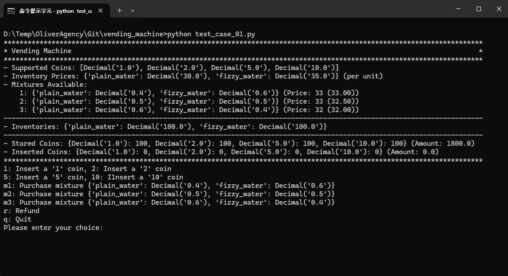

# Vending Machine
The task:

Write a vending machine program in Python with the following features:

- It should sell plain and fizzy water in 2 to 3 proportions.
- Plain water should cost 30, and fizzy water should cost 35.
- It should accept 1, 2, 5, and 10 money coins for purchasing.
- The machine should provide change.
- It should track inventory.

You can use either OOP or functional programming.
The program should be compatible with Python versions 3.7 to 3.9.

# Usage
Example:
```bash
python test_case_01.py
```


# Assumptions
Here are some assumptions for this implementation:

- The vending machine sells a mixture of plain and fizzy water.
- A purchasing price is calculated according to the mixing ratio of water.
- A purchasing price is always an integer (e.g. 32.5 -> 33).
- The supported coins are customizable.
- The water prices are customizable.
- The water mixture ratios are customizable.
- The coins available for change are customizable.
- The water inventories are customizable.
- There are limited coins and water in the vending machine.
- All the water mixing ratios are normalized to 1.0 (e.g. 2:3 -> 0.4:0.6).
- The water prices are unit prices for one serving size.
- The plain and fizzy water are mixed as one serving size for each purchase.
- The code of the UI is separated from the vending machine logic.
- No purchase is allowed when insufficient stock, no change or insufficient payment

```python
vending_machine = VendingMachineAsciiUi()

# define the coins supported
vending_machine.add_supported_coins(1.0)
vending_machine.add_supported_coins(2.0)
vending_machine.add_supported_coins(5.0)
vending_machine.add_supported_coins(10.0)

# set the water prices
vending_machine.set_inventory_price("plain_water", 30.0)
vending_machine.set_inventory_price("fizzy_water", 35.0)

# set the water mixtures
vending_machine.add_supported_mixture(1, {"plain_water": 0.4, "fizzy_water":  0.6})
vending_machine.add_supported_mixture(2, {"plain_water": 0.5, "fizzy_water":  0.5})
vending_machine.add_supported_mixture(3, {"plain_water": 0.6, "fizzy_water":  0.4})

# prepare coins for change
vending_machine.store_coin(1, 100)
vending_machine.store_coin(2, 100)
vending_machine.store_coin(5, 100)
vending_machine.store_coin(10, 100)

# prepare water for sale
vending_machine.add_inventory("plain_water", 100)
vending_machine.add_inventory("fizzy_water", 100)
```
